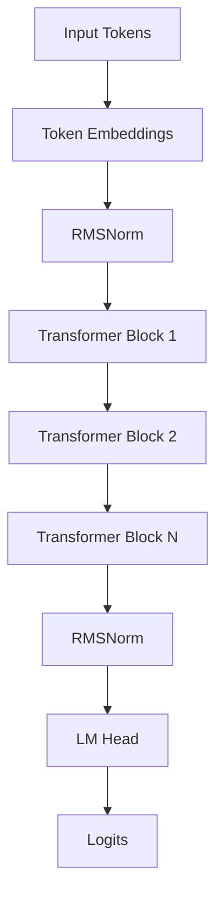
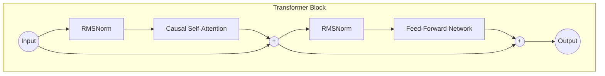

# AI Model Architecture

The `nanochat` project implements a modern, efficient GPT-style Transformer model designed for high performance and scalability. The implementation is located in `nanochat/gpt.py`.

## High-Level Overview

The model is a **Decoder-only Transformer** optimized for autoregressive generation. It deviates from the original GPT-2/3 architecture by incorporating several state-of-the-art improvements found in models like Llama 2/3 and Gemma.



## Core Components

### 1. Transformer Block
The model follows the standard pre-norm residual architecture but with specific enhancements:



*   **Rotary Positional Embeddings (RoPE)**: Instead of absolute positional embeddings, the model applies rotary position information to query and key vectors. Longer-context behavior still requires training and evaluation.
*   **QK Norm**: Layer normalization (RMSNorm) is applied to the Queries (Q) and Keys (K) *before* the attention mechanism. This stabilizes training, especially at larger scales.
*   **RMSNorm**: The model uses Root Mean Square Layer Normalization (RMSNorm) which is computationally more efficient than standard LayerNorm.
    *   **Purely Functional**: The implementation uses a purely functional RMSNorm with **no learnable parameters** (no affine transform `gamma` or `beta`), further reducing parameter count and memory usage.
    *   *Math*: $RMSNorm(x) = x \cdot \frac{1}{\sqrt{\frac{1}{n}\sum_{i=1}^{n} x_i^2 + \epsilon}}$
*   **MLP Activation**: The checkpoint-compatible default is Squared ReLU
    (`relu^2`). Newly trained checkpoints can opt in to SwiGLU with
    `use_swiglu=True`; the two choices have different state-dict shapes.
*   **No Bias**: Linear layers in the transformer blocks are bias-free, simplifying the model and slightly improving efficiency.

### 2. Attention Mechanism
The attention mechanism is optimized for both training and inference:

```mermaid
graph LR
    subgraph Multi-Query Attention
        Q[Queries (H heads)]
        K[Keys (1 head)]
        V[Values (1 head)]

        K --Broadcast--> K_Exp[Keys (H heads)]
        V --Broadcast--> V_Exp[Values (H heads)]

        Q --> Dot[Scaled Dot Product]
        K_Exp --> Dot
        Dot --> Softmax
        Softmax --> Out
        V_Exp --> Out
    end
```

*   **Multi-Query Attention (MQA)**: The model uses MQA, where multiple query heads share a single key/value head. This significantly reduces the memory bandwidth required for loading keys and values during inference (KV cache), leading to faster generation.
    *   `n_head`: Number of query heads (e.g., 6).
    *   `n_kv_head`: Number of key/value heads (e.g., 6). *Note: In the default config, `n_head == n_kv_head`, effectively standard Multi-Head Attention, but the code supports MQA.*
*   **KV Cache**: The implementation supports Key-Value caching to speed up autoregressive generation.

### 3. Embeddings & Head
*   **Untied Weights**: Unlike some models (like GPT-2) that tie the weights of the token embedding layer and the final language model head, this implementation keeps them separate (`wte` vs `lm_head`).
    *   *Rationale*: While tying weights saves parameters, untying them allows the embedding layer and the output head to learn different representations, often leading to better performance, especially when using different learning rates for them (as we do).
*   **Norm after Embedding**: A normalization layer is applied immediately after the token embeddings, before entering the transformer blocks.

## Parameter Initialization

The model uses a specific initialization strategy to ensure stable training from the start:

*   **Linear Layers**: Initialized with a normal distribution with mean 0 and standard deviation scaled by $1/\sqrt{fan\_in}$.
    *   *Scaling*: $std = \frac{1}{\sqrt{fan\_in}} \cdot \min(1.0, \sqrt{\frac{fan\_out}{fan\_in}})$
*   **Embeddings**: Initialized with a normal distribution (mean 0, std 1.0).
*   **Biases**: Initialized to zero (where they exist).
*   **Residual Projections**: The output projections of the Attention and MLP layers are initialized to zero. This effectively makes the transformer blocks identity functions at initialization, allowing gradients to flow easily.

## Configuration (`GPTConfig`)

The default configuration is lightweight, suitable for testing and small-scale experiments:
*   **Sequence Length**: 1024 tokens
*   **Vocab Size**: 50,304 tokens
*   **Layers**: 12
*   **Heads**: 6
*   **Embedding Dimension**: 768
*   **Precision**: `bfloat16` (designed for modern GPUs).
*   **Flash Attention**: Utilizes `F.scaled_dot_product_attention`.
