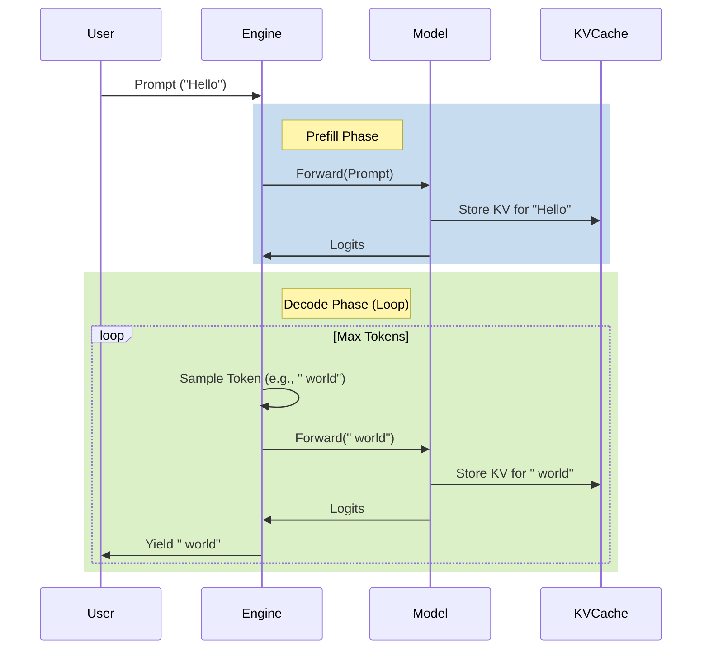

# Inference Engine & Server

The inference system in `nanochat` provides a compact custom engine and a
multi-GPU research web server.

## Core Engine (`nanochat/engine.py`)

The `Engine` class wraps the model to provide efficient autoregressive generation.

### Generation Loop

The generation process is split into two phases: **Prefill** (processing the prompt) and **Decode** (generating new tokens).



### Key Features
*   **KV Cache**: Implements a `KVCache` that manages Key/Value tensors for each layer.
    *   **Memory Layout**: The cache is pre-allocated on the GPU to avoid fragmentation. It stores tensors of shape `(Batch, Max_Seq_Len, KV_Heads, Head_Dim)`.
    *   **Prefill**: Efficiently processing the prompt in a single forward pass (parallel).
    *   **Dynamic Growth**: Automatically resizing the cache buffer as the sequence grows (if not pre-allocated).
*   **Generation Loop**:
    *   **Batch 1 Prefill**: The prompt is processed once.
    *   **Cache Replication**: The prefilled cache is cloned to support multiple independent samples (beams/rows) from the same prompt.
    *   **Row State**: Tracks the state of each generation row (tokens generated, completion status, tool use state).
*   **Tool Integration**: The engine natively detects tool-use tokens (e.g., `<|python_start|>`) and can pause generation to execute tools (like a calculator) before resuming.

## Web Server (`scripts/chat_web.py`)

The project includes a local/research web server built with **FastAPI**. It has
no authentication or rate limiting, logs message content, and uses permissive
CORS, so it needs an external security boundary before deployment.

### Architecture

The server uses a **Worker Pool** pattern to handle concurrent requests across multiple GPUs.

```mermaid
graph TD
    Client[Client Browser] -->|HTTP POST| API[FastAPI Endpoint]
    API -->|Enqueue| Queue[Request Queue]

    subgraph Worker Pool
        Worker1[Worker (GPU 0)]
        Worker2[Worker (GPU 1)]
        WorkerN[Worker (GPU N)]
    end

    Queue -->|Dequeue| Worker1
    Queue -->|Dequeue| Worker2
    Queue -->|Dequeue| WorkerN

    Worker1 -->|SSE Stream| Client
    Worker2 -->|SSE Stream| Client
    WorkerN -->|SSE Stream| Client
```

*   **Unified Server**: Serves both the static UI (`/`) and the API (`/chat/completions`) from a single process.
*   **Multi-GPU Worker Pool**:
    *   The server detects available GPUs and initializes a `Worker` on each one.
    *   Each `Worker` holds a full replica of the model and its own `Engine` instance.
    *   Incoming requests are distributed to available workers via an async queue.
*   **Streaming**: The `/chat/completions` endpoint supports Server-Sent Events (SSE) to stream tokens to the client as they are generated.

### API Endpoints
*   `GET /`: Serves the Chat UI (`nanochat/ui.html`).
*   `POST /chat/completions`: Project-specific streaming chat endpoint.
*   `GET /health`: Returns the status of the worker pool.
*   `GET /stats`: Returns detailed worker statistics (busy/available count).

### Request Bounds
The server validates several resource-related limits:
*   Max messages per request (500).
*   Max characters per message (8000).
*   Total conversation length limit (32000 chars).
*   Parameter clamping (Temperature 0.0-2.0, Top-k 1-200).

## CLI (`scripts/chat_cli.py`)

A simple command-line interface is also provided for local testing and debugging. It uses the same `Engine` but runs in a simple input/output loop in the terminal.
