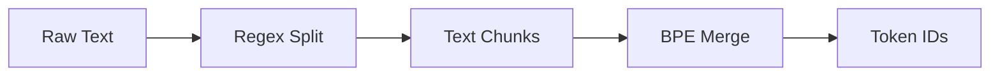

# Tokenization

The project uses a custom Byte-Pair Encoding (BPE) tokenizer designed to be compatible with GPT-4's tokenization scheme but optimized for the specific needs of `nanochat`. Implementation is in `nanochat/tokenizer.py`.

## Process Flow



## Dual Implementation

The tokenizer module provides two implementations:

1.  **HuggingFace Tokenizer Wrapper**: Wraps the standard `tokenizers` library. Useful for compatibility and training using the HF ecosystem.
2.  **RustBPE + Tiktoken**: A custom high-performance implementation.
    *   **Training**: Uses a custom Rust-based BPE trainer (`rustbpe`) for speed.
    *   **Inference**: Uses OpenAI's `tiktoken` library for extremely fast encoding/decoding during inference.

## Vocabulary & Splitting

*   **Split Pattern**: Uses a regex pattern similar to GPT-4 to pre-segment text before BPE merging.
    *   *Difference*: Uses `\p{N}{1,2}` instead of `\p{N}{1,3}` for numbers, aiming to be less wasteful with token space for smaller vocabularies.
*   **Vocab Size**: Defaults to ~50k (50304 in config).

## Special Tokens

The tokenizer includes a rich set of special tokens to support chat and tool use:

| Token | Purpose |
| :--- | :--- |
| `<|bos|>` | Beginning of Sequence (document delimiter) |
| `<|user_start|>` / `<|user_end|>` | Delimits user messages |
| `<|assistant_start|>` / `<|assistant_end|>` | Delimits assistant responses |
| `<|python_start|>` / `<|python_end|>` | Delimits restricted numeric calculator expressions in the current engine |
| `<|output_start|>` / `<|output_end|>` | Delimits calculator output forced back into generation |

## Chat Format

The `render_conversation` method handles converting a list of messages (User/Assistant/System) into a flat sequence of token IDs.

### Visual Structure

```mermaid
graph TD
    subgraph Document
        BOS[<|bos|>]

        subgraph User Message
            US[<|user_start|>] --> UContent[Hello]
            UContent --> UE[<|user_end|>]
        end

        subgraph Assistant Message
            AS[<|assistant_start|>] --> AContent[Hi there!]
            AContent --> AE[<|assistant_end|>]
        end

        BOS --> US
        UE --> AS
    end
```

### Masking
During training, we only want the model to learn to predict the **Assistant's** output.
*   **User Tokens**: Masked (Loss = 0).
*   **Assistant Tokens**: Unmasked (Loss calculated).
*   **System/Tool Output**: Masked.
