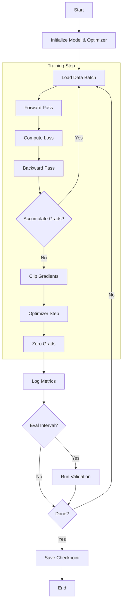

# Training Loop & Methodology

The training process in `nanochat` is orchestrated by `scripts/base_train.py`. It is designed to be robust, scalable (DDP), and informative (WandB logging).

## Training Loop Overview

The training loop follows a standard deep learning paradigm but with specific optimizations for Large Language Models.

## Key Components

### 1. Gradient Accumulation
To simulate large batch sizes (e.g., 0.5M tokens) on limited hardware, the system uses gradient accumulation.
*   **Micro-Batch**: The batch size that fits on a single GPU (e.g., 32).
*   **Global Batch**: The target batch size for optimization.
*   **Accumulation Steps**: `Global Batch / (Micro Batch * World Size)`.
*   *Mechanism*: Gradients are accumulated over multiple forward/backward passes before a single optimizer step is taken.

### 2. Distributed Data Parallel (DDP)
The script supports multi-GPU training via `torchrun`.
*   **Rank 0 (Master)**: Handles logging, checkpointing, and sampling.
*   **All Ranks**: Perform computation and gradient synchronization.
*   **Autocast**: Uses `torch.amp.autocast` with `bfloat16` for mixed-precision training.

### 3. Schedulers
*   **Learning Rate**: A custom scheduler with:
    *   **Warmup**: Linear increase from 0 to max LR.
    *   **Constant**: Hold max LR for a duration.
    *   **Warmdown**: Linear decay to a fraction of max LR.
*   **Momentum (Muon)**: The momentum for the Muon optimizer is also scheduled, typically increasing from 0.85 to 0.95 over time.

## Monitoring & Evaluation

### Metrics
*   **Loss**: Cross-entropy loss on the training set.
*   **BPB (Bits Per Byte)**: Validation metric, standard for language modeling.
*   **MFU (Model Flops Utilization)**: Measures hardware efficiency (percentage of peak theoretical FLOPs utilized).
*   **Tok/sec**: Throughput in tokens per second.

### Periodic Tasks
*   **Evaluation**: Every `eval_every` steps, the model is evaluated on the validation set.
*   **Sampling**: Every `sample_every` steps, the model generates text completions for a set of fixed prompts to visually inspect quality.
*   **CORE Metric**: Every `core_metric_every` steps, the model is evaluated on a suite of tasks (ARC, etc.) to track downstream performance.

## Checkpointing
Checkpoints are saved at the end of training (and potentially during, though the current script emphasizes the final save).
*   **Content**: Model state dict, Optimizer state dicts, Config, and current Step.
*   **Location**: `base_checkpoints/` directory.
